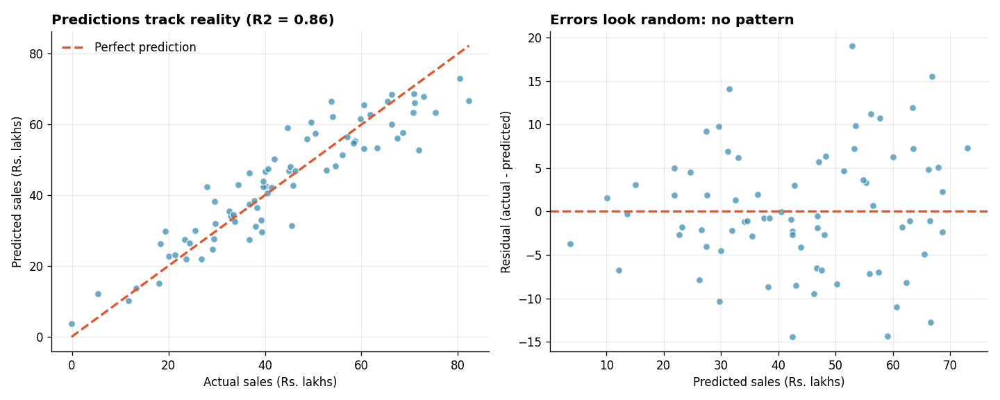

# Linear Regression for Sales Prediction

**Tools:** Python, Scikit-learn, Pandas, NumPy, Matplotlib
**File:** [`Linear Regression for Sales Prediction.py`](./Linear%20Regression%20for%20Sales%20Prediction.py)
**Chart:** [`charts/regression_results.png`](./charts/regression_results.png)



## What I Learned

Linear regression predicts a number (here, monthly store sales) from other numbers (ad spend, store size, nearby competitors, discount). Think of it as finding the **best-fitting straight line**, or in several dimensions the best-fitting flat surface, through your data, like a taxi fare formula: a base charge plus a rate per kilometre plus a rate per minute of waiting.

The business question: *which factors drive store sales, and how accurately can we predict them?*

## Workflow

| Step | What happens | Why it matters |
|------|--------------|----------------|
| 1 | Build a dataset where the true rule is known | Lets us check if the model recovers the truth |
| 2 | Correlations and multicollinearity check | Spot useful predictors and overlapping ones |
| 3 | Train/test split (75% / 25%) | Hold back a "final exam" the model never sees |
| 4 | Baseline model (always predict the average) | The bar every model must beat |
| 5 | Simple vs multiple regression | See what extra features add |
| 6 | Interpret coefficients | Turn maths into business meaning |
| 7 | R-squared, MAE, RMSE, cross-validation | Judge accuracy honestly |
| 8 | Residual analysis | Check the errors are random |
| 9 | Predict a new store, with a range | Give an estimate, not false precision |

## Results (simulated data, seed 42)

| Model | R² | MAE (Rs. lakh) | RMSE (Rs. lakh) |
|-------|-----|----------------|-----------------|
| Baseline (always average) | -0.003 | 15.00 | 18.37 |
| Simple (ad spend only) | 0.586 | 9.91 | 11.80 |
| Multiple (all 4 features) | **0.856** | **5.55** | **6.97** |

5-fold cross-validated R²: mean **0.793** (spread about ±0.03).

**Coefficients vs the true values used to create the data:**

| Feature | Learned | True |
|---------|---------|------|
| Ad spend (per Rs. 1 lakh) | 0.736 | 0.800 |
| Store size (per sq ft) | 0.014 | 0.012 |
| Competitors nearby (each) | -2.217 | -2.500 |
| Discount (per 1%) | -0.597 | -0.600 |

The model recovers the true rules closely, which confirms the pipeline works. In real projects the truth is never known, which is why testing matters.

**Example prediction:** a store with Rs. 40 lakh ad spend, 1,500 sq ft, 3 competitors and 10% discount is predicted at about **Rs. 56 lakh per month**, with a rough range of Rs. 42 to 70 lakh.

*All data is simulated, so these numbers describe the exercise, not a real business.*

## Key Concepts and Interview Points

**Always compare with a baseline.** The baseline (predict the average every time) scores an R² near 0. A model is only worth its complexity if it clearly beats this. In an interview, saying "I started with a baseline" signals mature thinking.

**Why a train/test split.** A student who sees the exam questions in advance looks brilliant but proves nothing. Evaluating on unseen test data shows how the model behaves on **new** stores. Never judge a model on the data it trained on.

**Reading the metrics.**

| Metric | Meaning | Note |
|--------|---------|------|
| R² | Share of the variation in sales the model explains (0 = nothing, 1 = everything) | Can be negative on test data if the model is worse than the average |
| MAE | Average size of the error, in the same units as sales | Easy to explain to non-technical people |
| RMSE | Like MAE but punishes big mistakes more | Always at least as large as MAE |

**Interpreting a coefficient.** "Each extra Rs. 1 lakh of ad spend adds about Rs. 0.74 lakh of sales, **holding the other features constant**." That last phrase matters, and interviewers listen for it.

**Raw coefficients are not comparable.** Ad spend (lakhs) and store size (square feet) use different units, so a bigger coefficient does not mean a bigger effect. Standardised coefficients put every feature on one scale: here ad spend (0.64) matters most, then competitors (-0.28).

**Multicollinearity.** Ad spend and store size are correlated (0.59), so they partly carry the same information. With strong overlap, coefficients become unstable and hard to interpret, even when predictions stay fine. Check the correlation matrix, and consider dropping or combining overlapping features.

**Cross-validation beats a single split.** One split can be lucky. Here the test R² (0.856) is higher than the training R² (0.792) purely because of which stores landed in the test set. The cross-validated mean (0.793) is the more honest estimate. A training score far **above** the test score would signal overfitting.

**Residuals should look like random noise.** Plot actual minus predicted: the errors should be centred on zero with no pattern. A curve means a straight line is the wrong shape. A funnel (errors growing with the prediction) means unequal variance. Both are common interview follow-ups.

**Assumptions of linear regression (LINE):**

| Letter | Assumption | Quick check |
|--------|------------|-------------|
| L | Relationship is linear | Residuals show no curve |
| I | Observations are independent | Think about how the data was collected |
| N | Errors are roughly normal | Histogram of residuals |
| E | Equal spread of errors | Residuals do not fan out |

**Correlation is not causation.** The model shows that sales rise with ad spend, not that ad spend *causes* the rise. A store might get more ads because it is already doing well. Experiments (like the A/B test in Day 3) are needed for causal claims.

**Give a range, not a single number.** A rough interval of about ±2 RMSE tells the business how uncertain the prediction is. A single number without a range gives a false sense of precision.

## How to Run

```bash
pip install numpy pandas scikit-learn matplotlib
python "Linear Regression for Sales Prediction.py"
```

The script prints each step and saves the chart in a `charts` folder next to it. The random seed is fixed, so your results match those above.

## Next Steps

- Try Ridge and Lasso regression and see how they handle overlapping features
- Add a categorical feature (such as city) with one-hot encoding
- Compare with a Decision Tree or Random Forest on the same data
- Test what happens when a few extreme outliers are added
