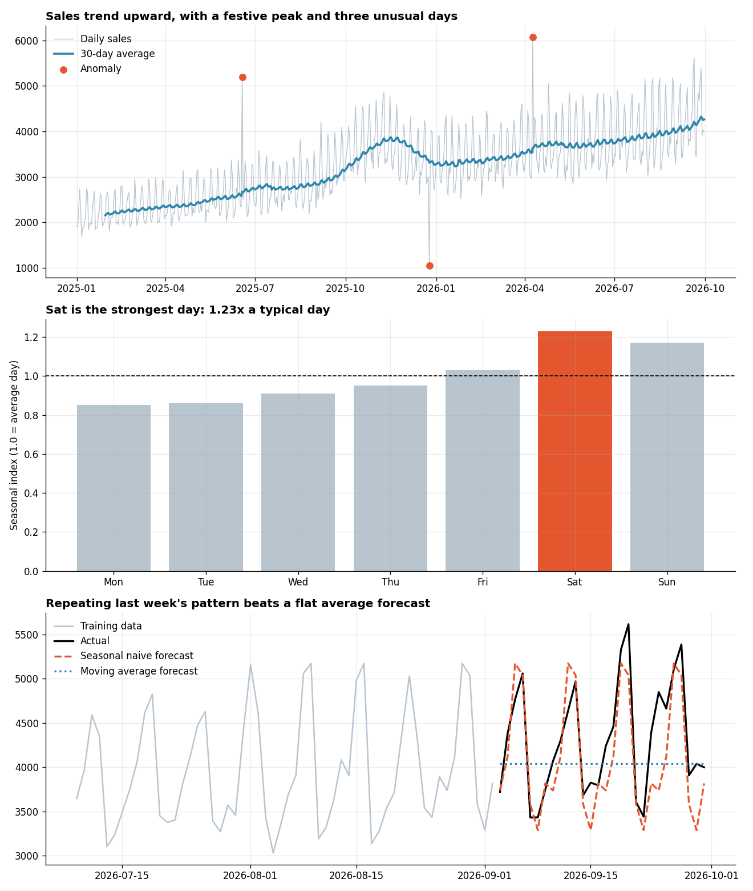

# Time Series Analysis with Pandas

**Tools:** Python, Pandas, NumPy, Matplotlib

**File:** [`Time Series Analysis with Pandas.py`](./Time%20Series%20Analysis%20with%20Pandas.py)

**Chart:** [`charts/time_series_overview.png`](./charts/time_series_overview.png)



## What I Learned

A time series is data where **the order of the rows matters**, such as daily sales, website visits or stock prices. Yesterday influences today, so the usual shortcuts (shuffling rows, random splits) break. Think of reading a story: you cannot shuffle the pages and still understand the plot.

The business question: *how are daily sales trending, what repeating patterns exist, which days were unusual, and can we forecast the next 4 weeks?*

## Workflow

| Step | Technique | Purpose |
|------|-----------|---------|
| 1 | Datetime index, `asfreq("D")`, `interpolate()` | Make dates real, find and fix missing days |
| 2 | `resample("W")`, `resample("ME")` | `GROUP BY` for time: days into weeks and months |
| 3 | `rolling(7)`, `rolling(30)` | Smooth the noise to reveal the trend |
| 4 | `shift()`, `pct_change()` | Month-over-month and year-over-year growth |
| 5 | Seasonal index by weekday and month | Quantify repeating patterns |
| 6 | Decomposition: trend x seasonality x residual | Separate the "ingredients" of the series |
| 7 | z-score on the residual | Detect unusual days |
| 8 | Baseline forecasts, time-ordered split | Forecast and evaluate honestly |

## Results (simulated data)

The data was built from known ingredients (growth trend, weekend peaks, a festive-season peak, and three injected unusual days), so we can check what the analysis finds.

**Weekday seasonal index** (1.00 = a typical day): Mon 0.85, Tue 0.86, Wed 0.91, Thu 0.95, Fri 1.03, **Sat 1.23**, Sun 1.17.

**Anomalies detected** (more than 4 standard deviations from normal after removing trend and weekday pattern):

| Date | Sales | z-score |
|------|-------|---------|
| 2025-06-18 | 5,192 | +12.3 |
| 2025-12-25 | 1,045 | -9.0 |
| 2026-04-09 | 6,075 | +9.3 |

All three injected unusual days were found, and nothing else was flagged.

**Forecasting the last 28 days:**

| Method | MAE | MAPE |
|--------|-----|------|
| Naive (repeat last value) | 618 | 13.1% |
| Moving average (28 days) | 551 | 12.1% |
| **Seasonal naive (same weekday last week)** | **303** | **6.9%** |

*All data is simulated, so these numbers describe the exercise, not a real business.*

## Key Concepts and Interview Points

**Make the date the index, and check for gaps first.** Rolling windows and lags assume one row per period. If three days are missing, a "7-row" window silently covers 10 days. `asfreq("D")` exposes the gaps as `NaN`, then you choose how to fill them.

**Filling gaps: interpolate, forward-fill, or leave it?** Linear interpolation is fine for a few isolated missing days. Forward-fill suits values that hold until changed (a price list). If the gap is long or the data is missing for a reason (a shop closed), filling can hide the truth, so ask why it is missing.

**`resample` vs `rolling`.** Resampling **changes the frequency** (365 daily rows become 12 monthly rows). Rolling **keeps the frequency** and smooths each point using its neighbours. Use `sum` when resampling flows (sales) and `mean` for levels (temperature, price).

**Trailing vs centred windows.** A trailing 7-day average uses only past days, so it is safe for forecasting features. A centred window looks at future days too, which is fine for describing history but is **data leakage** if used to predict. Interviewers like this one.

**MoM vs YoY growth.** Month-over-month growth is distorted by seasonality (December always beats November in retail). Year-over-year compares like with like, so it is the standard for seasonal businesses. It needs at least 12 months of history.

**Additive vs multiplicative seasonality.** If the weekend bump is a fixed number of units, use additive. If it grows as the business grows (weekends are +25%, whatever the level), use multiplicative. This script uses multiplicative, and the residual averages 1.0, which is the sign it fits.

**Trend, seasonality, residual.** Decomposition splits a series like a smoothie back into its fruit. The residual is what is left, and anomalies live there. Flagging unusual days on the raw series would wrongly flag every normal weekend.

**Investigate anomalies, do not just delete them.** A spike might be a festival, a data error or a one-off bulk order. Each has a different action. In the script, the dip on 25 December is a real-world effect worth explaining, not noise to remove.

**Never shuffle a time series.** A random train/test split lets the model train on the future and predict the past. Always train on the earlier period and test on the later one.

**Always start with simple baselines.** Naive and seasonal naive forecasts are quick, and they set the bar. Here "repeat last week" cut the error roughly in half versus a flat average, because the weekly pattern is so strong. If a complex model (ARIMA, Prophet, LSTM) cannot beat seasonal naive, it is not worth deploying.

**Metrics.** MAE is in the units of sales and easy to explain. MAPE gives a percentage, which executives like, but it breaks when actual values are near or at zero and over-penalises low-volume days.

**Stationarity (the next thing to learn).** Many classical models (ARIMA) assume the series has a stable mean and variance. Trends and seasonality break that, which is why they are removed or differenced first.

## How to Run

```bash
pip install numpy pandas matplotlib
python "Time Series Analysis with Pandas.py"
```

The script prints each step and saves the chart in a `charts` folder next to it. The random seed is fixed, so your results match those above.

## Next Steps

- Try Holt-Winters or Prophet and compare with the seasonal naive baseline
- Add lag features (sales 7 and 14 days ago) and fit a regression like Day 8
- Test a rolling-origin evaluation (several train/test windows) for a sturdier error estimate
- Rebuild the weekly and monthly summaries in SQL with window functions
