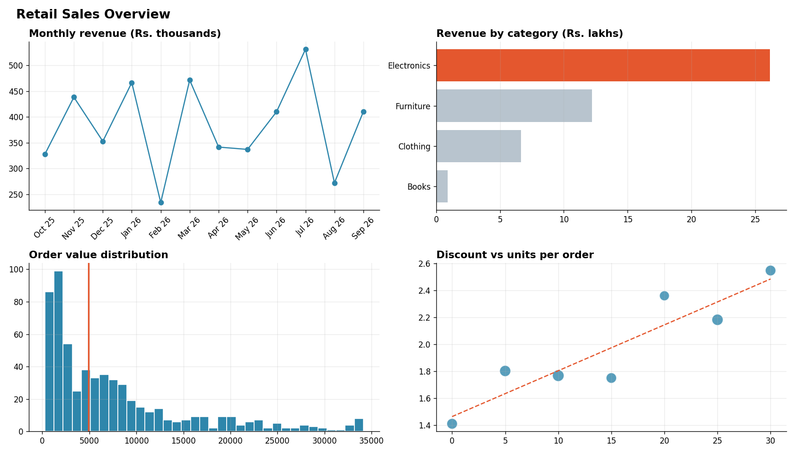
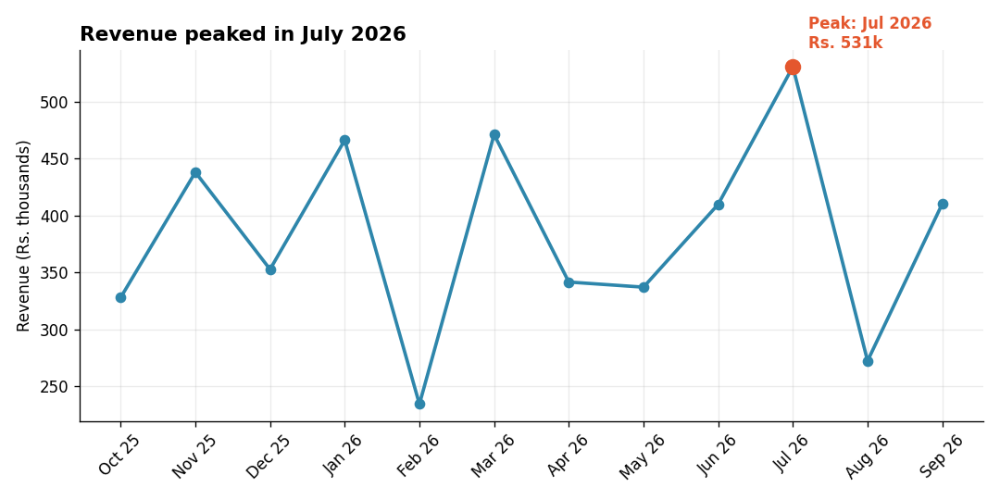
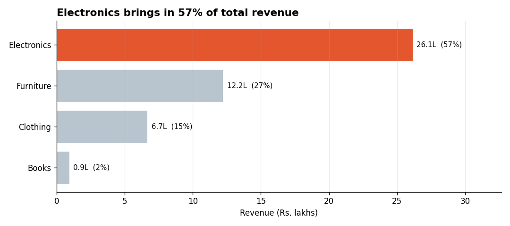
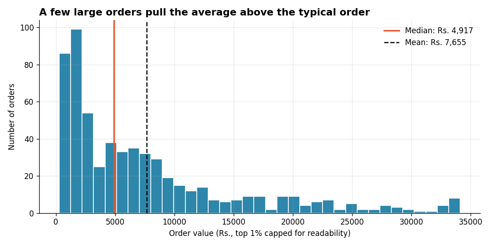
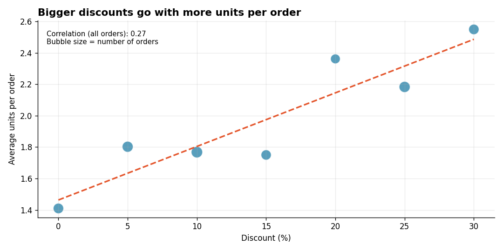

# Matplotlib Charts for Business Insights

**Tools:** Python, Matplotlib, Pandas, NumPy

**File:** [`Matplotlib Charts for Business Insights.py`](./Matplotlib%20Charts%20for%20Business%20Insights.py)
**Charts:** saved in the [`charts`](./charts) folder



## What I Learned

A chart is not decoration, it is an **answer to a business question**. The skill is picking the right chart for the question and then making the one important thing impossible to miss. Think of a good chart like a good road sign: you should get the message in two seconds without reading the manual.

The script builds a sample retail dataset (12 months, 600 orders) and draws four charts, each matched to a question. Every title states the **insight**, calculated from the data, instead of just naming the topic.

## Choosing the Right Chart

| Business question | Chart | Why this one |
|-------------------|-------|--------------|
| How is revenue changing over time? | **Line chart** | Time is ordered, and the line shows the sequence |
| Which category earns the most? | **Horizontal bar chart** | Bars compare categories; sorting makes the ranking obvious |
| What does a typical order look like? | **Histogram** | Shows the shape of one numeric column |
| Does discounting lead to more units sold? | **Scatter plot** | Shows whether two numbers move together |

## The Four Charts

### 1. Monthly revenue trend


Revenue peaked in **July 2026**. The peak is highlighted and annotated so nobody has to hunt for it.

### 2. Revenue by category


**Electronics brings in 57% of total revenue.** Only the winner is coloured; every other bar is muted grey, so the eye goes straight to it.

### 3. Order value distribution


The **median order is about Rs. 4,917 while the mean is about Rs. 7,655**. A few very large orders pull the average up, so the median is the better "typical order" number.

### 4. Discount vs units per order


Bigger discounts go with more units per order (correlation about 0.27 across all orders). That is a weak-to-moderate relationship, and it does not prove that discounts caused the extra units.

*The data is simulated, so these numbers describe the exercise only, not a real business.*

## Key Concepts and Interview Points

**Title with the insight, not the topic.** "Electronics brings in 57% of total revenue" tells the viewer what to conclude. "Revenue by Category" makes them work it out. Executives skim, so the title must carry the message. This is how strong analysts stand out in case-study rounds.

**One highlight colour.** Use muted colours for context and a single strong colour for the point you want noticed. If everything is colourful, nothing stands out.

**Pick the chart from the question.** Trend over time means line. Comparing categories means bar. Distribution of one variable means histogram. Relationship between two numbers means scatter. If you can state the question first, the chart choice follows.

**Mean vs median on skewed data.** Order values and incomes are right-skewed, so the mean is dragged up by a few large values. Showing both lines on the histogram makes the point visually. A common interview question: *"When would you report the median instead of the mean?"*

**Correlation is not causation.** The scatter plot shows that discount and units rise together, but customers may be buying more for other reasons, or the business may discount slow items. Always say "associated with" unless an experiment (like the A/B test from Day 3) supports causation.

**Honest charts.**
- Bar charts must start at zero, because bar length represents the value.
- Avoid 3D effects and, in most cases, pie charts, since people compare lengths far more accurately than angles.
- Label axes with units (Rs. thousands, Rs. lakhs) so numbers are not misread.
- Sort bars instead of leaving them alphabetical.

**Reduce clutter ("data-ink" idea).** The script removes the top and right borders and uses faint gridlines. Everything on a chart should earn its place.

**Handle outliers deliberately.** In the histogram, the top 1% of values is capped so a handful of huge orders do not squash the rest of the chart. The axis label states that this was done, so the chart stays honest.

**Make it repeatable.** Setting the style once with `plt.rcParams` and saving every chart from code means the whole set can be regenerated with one command when the data changes. This beats manual formatting every time.

## How to Run

```bash
pip install numpy pandas matplotlib
python "Matplotlib Charts for Business Insights.py"
```

The script creates a `charts` folder next to it and saves five PNG images. The random seed is fixed, so your charts match the ones shown here.

## Next Steps

- Add Seaborn versions of the same charts and compare the effort
- Build a stacked bar of category revenue by month
- Recreate the dashboard in Power BI and compare the two approaches
